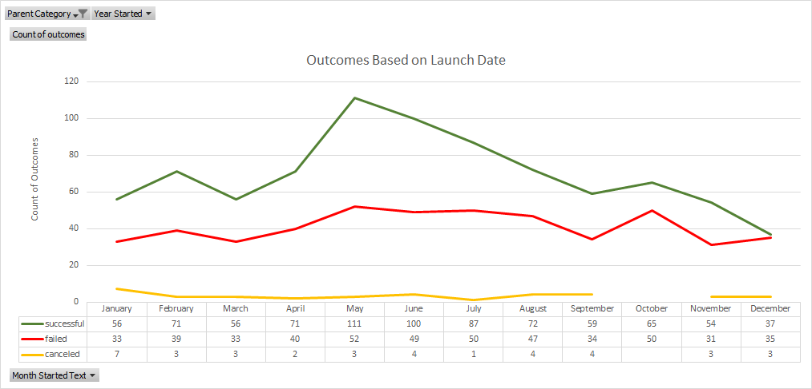
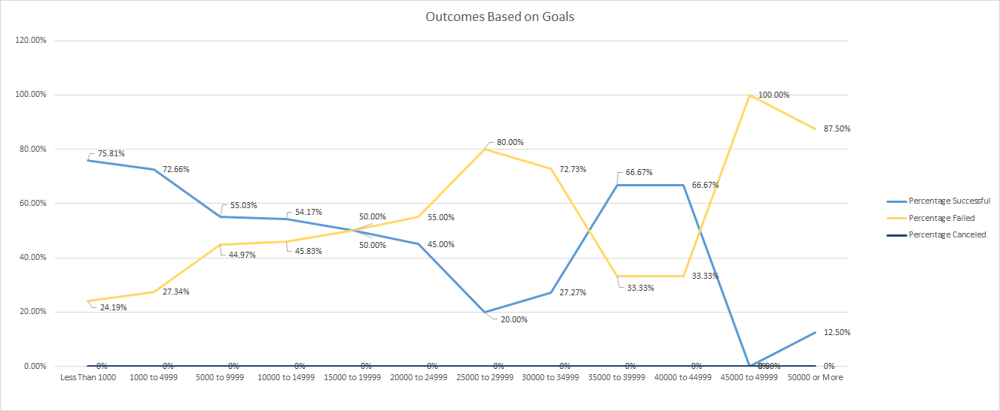

# **Kickstart my Heart**

## Project Overview
  Louise, an aspiring playwright, launched a Kickstarter campaign for her play *Fever* to aquire sufficient funding.  It was mostly successfully, almost reaching her goal in a short period.  Louise has contracted me to answer her questions about Kickstarter launch timing as well as how well similar projects have fared based on their monetary goals.  She would like to know more about these factors that could potentially affect the success or failure of her future campaigns.  With regard to this question, I will be taking a look at a data set of over 4000 Kickstarter projects .
### Purpose
  The purpose in these analyses is to uncover any trends that relate to the success or failure of Kickstarter projects.  Specifically, theater projects will be of interest in the available data so that we can relate any findings back to Louise's goals. A sub-group of theater projects that is also of interest is plays.  Ideally, the results and consequent conclusions will help Louise make more informed decisions about her future projects.
## Analysis and Challenges
  In the following analyses, tabular data describing specific attributes in my data set were used to create graphical visualizations.  The first set of tabular data is in a pivot table format, which can be dyanamically viewed to drill down to specific information.  This data analyzes the success, failure and cancellation of 1312 kickstarter projects over the course of 8 years.  Multiple filters can be applied to the pivot table to view data for theater projects. Additionally, the pivot table can be filtered by year and further broken down into individual months.  The second set of tabular data was created by hand rather than using a pivot table. This table was used to analyze campaign success based on the monetary campaign goals. Data was retrieved for this table using the COUNTIFS function.  After creating multiple "goal amount bands", I used the COUNTIFS function to return counts of successful, failed, and canceled projects in each band. The 12 bands begin with $0 to $1000, $1000 to $4999, and then continue to $50,000 or more in groupings of $5000. 

### Outcomes Based on Launch Date

  The chart above is a visual description of outcomes over time.  It includes data from theater projects launched between 2009 and 2017.  As can be seen in the visual, successful kickstarter projects are greater over time than either failed projects or canceled projects.  Although the amount of cancelled projects stays somewhat steady over this time period, the amount of canceled projects is quite low compared to the numbers for failed and successful projects.  The canceled project outcome will not be relevant to this analysis.  Instead, it may be useful to look at the months with the most successful theater projects.  It appears that May, June, and July each have more successful theater projects than the other months in this subset of data.  

---  
     
  Interestingly, if the chart is filtered by the years 2014, 2015, and 2016 our trend over time does not seem to change.  This is because most of the theater projects in this sample were launched in that range of time.  Data from those three years comprises about 96% of the data points for the sample.  Unfortunately, there is very little recent data in this sample that could provide insight into theater project success over time. Additionally, this data is categorical and can only give us the number of successful, failed, and canceled projects.  Just because there appears to be more successful Kickstarter projects in May as opposed to December does not necessarily mean that Louise will have a successful campaign if she launches in May.  There are likely other factors that could affect a Kickstarter's outcome.  For example, the type of marketing that one does could have an effect on outcome.  If Louise relies solely on social media to advertise future projects during the month of May, she may not be reaching as many backers as possible.  May being one of the warmer months of the year, Louise may want to tailor her advertisement strategy to reach more backers in high foot traffic areas.
  
### Outcomes Based on Goals

This third graphic is a visualization of the percentage of successful, failed, and canceled outcomes based on goal ranges.  If we look at the first two ranges, "Less than $1,000" and "$1,000 to $4,999", it appears that, respectively, 75.81% and 72.66% of projects were successful.  The percentage of successful projects begins to fall as Kickstarter goal amounts increase.  However, once we look at projects between $35,000 and $39,999, the percentage of successful Kickstarters increases to 66.67%.  The goal range "$40,000 to $44,999" has the same percentage of successful projects.  At first glance, this looks like a positive thing that could help Louise make a decision on her budget if she is looking at producing a larger project.  However, it would be wise to look at the number of projects used to calculate these percentages in the higher "goal" categories. Of these two higher goal groups, there were only nine Kickstarter projects.  Six of those succeeded and three failed.  This is not much data to help Louise make a decision if she is looking at setting a high Kickstarter goal.  In the "$1,000 to $4,999" range there are 534 projects, which is slightly over half of the data for this sub-sample.  Based on the number of cases in this sub-group and the percentage of success, this looks like a promising goal range for Louise.

### Challenges
One of the challenges I had with this data set was figuring out how to compare outcomes to Kickstarter goal amounts.  The goal amount in its raw form is continuous, whereas the outcomes are catergorical.  At first, I was not sure how to properly visualize this data, so I attempted to create a pivot table to organize the average goal amount for each outcome group.  However, I realized that finding one average for each group would only yield three data points, which may not be very informative to Louise or very visually appealing in a chart.  I overcame this by referencing my module challenge on boot camp spot to get ideas for how to best organize monetary values.  

## Results
Based on the outcomes vs launch date chart, I would conclude that theater Kickstarter campaigns are more successful in May, June, and July than other months of the year.  It would make sense for Louise to consider launching her campaign during one of those months.  Additionally, the number of successful campaigns is almost the same as the number of failed campaigns in December.  December does not seem to be a logical time for Louis to launch her campaign.

---
In the Outcomes Based on Goals visualization, it appears that Louise would have a good chance of success if she set her campaign goal between $1 and $4999.  Assuming the percentage of successful campaigns is how we define Louise's chance of success in this chart, it would also appear that her chance of success is high if she sets her goal between $35,000 and $44,999.  However, a small number of individuals makes up that range of Kickstarter goals.  It would not make sense to recommend that Louise could set her goal that high, and still have relatively the same chance of success as projects with lower goals.  However, it does appear that if she set her goal between $1,000 and $4,999, she has a fairly high chance of success.  I would conclude that this range is where she should set her goal.

---
One of the biggest limitations of this dataset is that most of this data is categorical.  There really is not other way to measure Kickstarter success though aside from whether a project met its funding goal.  If a project meets its goal it is labeled "successful", and if it did not meet its goal then it is labeled "failed."  These labels do not really tell us much about what made the campaign succeed in the first place.  

---
Perhaps creating a column for number of days the campaign was active and comparing that to goals may give Louise an idea of how quickly her project can be funded depending on where she sets her goal.  This could be important to her if she is on a tight deadline, and may only need to partially fund her project using Kickstarter.  Additionally, calculating some descriptive statistics for goal amounts between successful and failed projects may give us a better idea of their distributions.  The median and mean may show that both distributions are skewed, but I would expect the skewness to be drastically greater for failed projects.  As seen in this data set, higher goals are not very common for successful Kickstarters, and are more common for failed Kickstarters.
